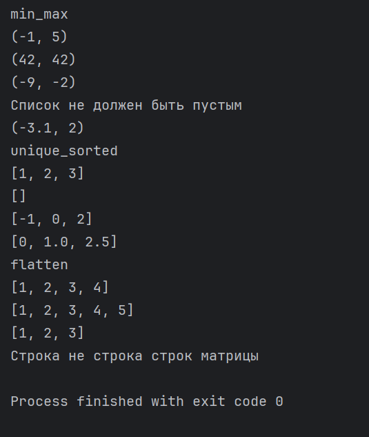
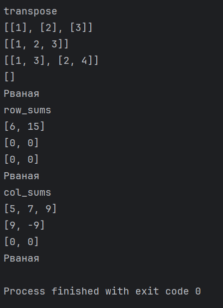
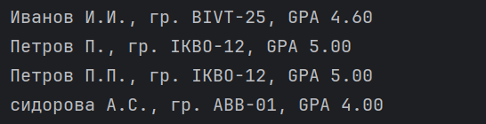

# ЛР2 — Коллекции и матрицы (list/tuple/set/dict)

## Структура
- Код: `src/lab02/`
- Скриншоты: `images/lab02/`

---

## Задание 1 — `arrays.py`
**Файл:** `arrays.py`  
**Реализуйте функции:**

1. `min_max(nums: list[float | int]) -> tuple[float | int, float | int]`  
   Вернуть кортеж `(минимум, максимум)`. Если список пуст — `ValueError`.

2. `unique_sorted(nums: list[float | int]) -> list[float | int]`  
   Вернуть **отсортированный** список **уникальных** значений (по возрастанию).

3. `flatten(mat: list[list | tuple]) -> list`  
   «Расплющить» список списков/кортежей в один список по строкам (row-major).
   Если встретилась строка/элемент, который не является списком/кортежем — `TypeError`..  

### Тест кейсы(минимум)
**min_max**
- `[3, -1, 5, 5, 0]` → `(-1, 5)`
- `[42]` → `(42, 42)`
- `[-5, -2, -9]` → `(-9, -2)`
- `[]` → `ValueError`
- `[1.5, 2, 2.0, -3.1]` → `(-3.1, 2)`

**unique_sorted**
- `[3, 1, 2, 1, 3]` → `[1, 2, 3]`
- `[]` → `[]`
- `[-1, -1, 0, 2, 2]` → `[-1, 0, 2]`
- `[1.0, 1, 2.5, 2.5, 0]` → `[0, 1.0, 2.5]` *(допускаем смешение int/float)*

**flatten**
- `[[1, 2], [3, 4]]` → `[1, 2, 3, 4]`
- `[[1, 2], (3, 4, 5)]` → `[1, 2, 3, 4, 5]`
- `[[1], [], [2, 3]]` → `[1, 2, 3]`
- `[[1, 2], "ab"]` → `TypeError` *(«строка не строка строк матрицы»)*

### Код:
```
def min_max(nums: list[float | int]) -> tuple[float | int]:
    if not nums:
        raise ValueError('Список не должен быть пустым')
    return (min(nums), max(nums))
def unique_sorted(nums: list[float | int]) -> list[float | int]:
    return sorted(set(nums))
def flatten(mat: list[list | tuple]) -> list:
    flat_list = []
    for element in mat:
        if not isinstance(element, (list, tuple)):
            raise TypeError('Строка не строка строк матрицы')
        else:
            flat_list.extend(element)
    return flat_list

#        Тест кейсы

print('min_max')
print(min_max([3, -1, 5, 5, 0]))
print(min_max([42]))
print(min_max([-5, -2, -9]))
try:
    print(min_max([]))
except ValueError as e:
    print(e)
print(min_max([1.5, 2, 2.0, -3.1]))

print('unique_sorted')
print(unique_sorted([3, 1, 2, 1, 3]))
print(unique_sorted([]))
print(unique_sorted([-1, -1, 0, 2, 2]))
print(unique_sorted([1.0, 1, 2.5, 0]))

print('flatten')
print(flatten([[1, 2], [3, 4]]))
print(flatten([[1, 2], (3, 4, 5)]))
print(flatten([[1], [], [2, 3]]))
try:
    print(flatten([[1, 2], 'ab']))
except TypeError as e:
    print(e)
```

**Скриншот:**  


---

## Задание 2 — `matrix.py`
**Файл:** `matrix.py`  
**Реализуйте функции (для **прямоугольных** матриц — одинаковая длина строк):**   

1. `transpose(mat: list[list[float | int]]) -> list[list]`  
   Поменять строки и столбцы местами. Пустая матрица `[]` → `[]`.  
   Если матрица «рваная» (строки разной длины) — `ValueError`.

2. `row_sums(mat: list[list[float | int]]) -> list[float]`  
   Сумма по каждой строке. Требуется прямоугольность (см. выше).

3. `col_sums(mat: list[list[float | int]]) -> list[float]`  
   Сумма по каждому столбцу. Требуется прямоугольность.

### Тест кейсы (минимум)
**transpose**
- `[[1, 2, 3]]` → `[[1], [2], [3]]`
- `[[1], [2], [3]]` → `[[1, 2, 3]]`
- `[[1, 2], [3, 4]]` → `[[1, 3], [2, 4]]`
- `[]` → `[]`
- `[[1, 2], [3]]` → `ValueError` *(рваная)*

**row_sums**
- `[[1, 2, 3], [4, 5, 6]]` → `[6, 15]`
- `[[-1, 1], [10, -10]]` → `[0, 0]`
- `[[0, 0], [0, 0]]` → `[0, 0]`
- `[[1, 2], [3]]` → `ValueError` *(рваная)*

**col_sums**
- `[[1, 2, 3], [4, 5, 6]]` → `[5, 7, 9]`
- `[[-1, 1], [10, -10]]` → `[9, -9]`
- `[[0, 0], [0, 0]]` → `[0, 0]`
- `[[1, 2], [3]]` → `ValueError` *(рваная)*

**Код**
```
def transpose(mat: list[list[float | int]]) -> list[list[float | int]]:
    if not mat:
        return []
    num_rows = len(mat)
    num_cols = len(mat[0])
    for row in mat:
        if len(row) != num_cols:
            raise ValueError('Рваная')

    transposed_mat = [[mat[i][j] for i in range(num_rows)] for j in range(num_cols)]
    return transposed_mat

def row_sums(mat: list[list[float | int]]) -> list[float]:
    if not mat:
        return []
    num_cols = len(mat[0])
    for row in mat:
        if len(row) != num_cols:
            raise ValueError("Рваная")
    return [sum(row) for row in mat]

def col_sums(mat: list[list[float | int]]) -> list[float]:
    if not mat:
        return []
    num_cols = len(mat[0])
    for row in mat:
        if len(row) != num_cols:
            raise ValueError("Рваная")
    return [sum(mat[i][j] for i in range(len(mat))) for j in range(num_cols)]


#     Тест кейсы

print('transpose')
print(transpose([[1, 2, 3]]))
print(transpose([[1], [2], [3]]))
print(transpose([[1, 2], [3, 4]]))
print(transpose([]))
try:
    print(transpose([[1, 2], [3]]))
except ValueError as e:
    print(e)

print('row_sums')
print(row_sums([[1, 2, 3], [4, 5, 6]]))
print(row_sums([[-1, 1], [10, -10]]))
print(row_sums([[0, 0], [0, 0]]))
try:
    print(row_sums([[1, 2], [3]]))
except ValueError as e:
    print(e)

print('col_sums')
print(col_sums([[1, 2, 3], [4, 5, 6]]))
print(col_sums([[-1, 1], [10, -10]]))
print(col_sums([[0, 0], [0, 0]]))
try:
    print(col_sums([[1, 2], [3]]))
except ValueError as e:
    print(e)
```

**Скриншот:**  


---

## Задание 3 — `tuples.py`
**Файл:** `tuples.py`  
**Работаем с «записями» как с кортежами:**

1. Определите тип записи студента как кортеж:  
   `(fio: str, group: str, gpa: float)`

2. Реализуйте `format_record(rec: tuple[str, str, float]) -> str`  
   Вернуть строку вида:  
   `Иванов И.И., гр. BIVT-25, GPA 4.60`  
   **Правила:**
   - ФИО может быть `«Фамилия Имя Отчество»` или `«Фамилия Имя»` — инициалы формируются из 1–2 имён (в верхнем регистре).
   - Лишние пробелы нужно убрать (`strip`, «схлопнуть» внутри).
   - GPA печатается с **2 знаками** (округление правилами Python).
### Тест кейсы(минимум)
- `("Иванов Иван Иванович", "BIVT-25", 4.6)` → `"Иванов И.И., гр. BIVT-25, GPA 4.60"`
- `("Петров Пётр", "IKBO-12", 5.0)` → `"Петров П., гр. IKBO-12, GPA 5.00"`
- `("Петров Пётр Петрович", "IKBO-12", 5.0)` → `"Петров П.П., гр. IKBO-12, GPA 5.00"`
- `("  сидорова  анна   сергеевна ", "ABB-01", 3.999)` → `"Сидорова А.С., гр. ABB-01, GPA 4.00"`
- Некорректные записи (пустое ФИО, пустая группа, неверный тип GPA) → `ValueError`/`TypeError` по усмотрению (описать в докстринге).
- `("", "BIVT-25", 4.6)` → `ValueError`
- `("Иванов Иван", "", 4.6)` → `ValueError`
- `"Иванов Иван", "BIVT-25", "четыре")` → `TypeError`

**Код**
```
from typing import Tuple
StudentRecord = Tuple[str, str, float]
def format_record(rec: StudentRecord) -> str:
    fio, group, gpa = rec
    if not fio.strip() or not group.strip():
        raise ValueError("ФИО и группа не могут быть пустыми.")
    if not isinstance(gpa, (int, float)):
        raise TypeError("GPA должен быть числом (int или float).")
    fio_parts = [part.strip() for part in fio.split()]
    initials = "".join(part[0].upper() + '.' for part in fio_parts[1:])
    formatted_gpa = f"{gpa:.2f}"
    formatted_record = f"{fio_parts[0]} {initials}, гр. {group.strip()}, GPA {formatted_gpa}"
    return formatted_record


# Тест-кейсы
print(format_record(("Иванов Иван Иванович", "BIVT-25", 4.6)))
print(format_record(("Петров Пётр", "IKBO-12", 5.0)))
print(format_record(("Петров Пётр Петрович", "IKBO-12", 5.0)))
print(format_record(("  сидорова  анна   сергеевна ", "ABB-01", 3.999)))

# Примеры некорректных записей
try:
    print(format_record(("", "BIVT-25", 4.6)))
except ValueError as e:
    print(e)
try:
    print(format_record(("Иванов Иван", "", 4.6)))
except ValueError as e:
    print(e)
try:
    print(format_record(("Иванов Иван", "BIVT-25", "четыре")))
except TypeError as e:
    print(e)
```
**Скриншот:**  


---
