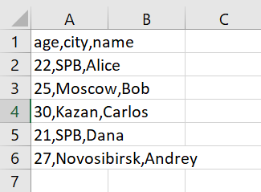
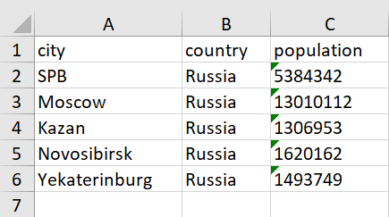

# ЛР5 — JSON и конвертации (JSON↔CSV, CSV→XLSX): Техническое задание

## Структура
- Код:*[Задание А](json_csv.py/)*
      *[Задание В](csv_xlsx.py/)*
- Скриншоты: `images/lab05/`

---

## Задание A — модуль `scr/lab05/json_csv.py`
**Файл:** `json_csv.py`  
**Реализуйте:** 
```python
def json_to_csv(json_path: str, csv_path: str) -> None:
    """
    Преобразует JSON в CSV.
    Порядок колонок — как в первом объекте.
    """
def csv_to_json(csv_path: str, json_path: str) -> None:
    """
    Преобразует CSV в JSON.
    Заголовок обязателен, значения сохраняются как строки.
    """
```
### Код:
```
from pathlib import Path
import json, csv

def json_to_csv(json_path:str, csv_path:str) -> None:
    json_file = Path(json_path)  # объект - файл с путем
    if not json_file.is_file():  # проверка существования файла
        raise FileNotFoundError(f"Файл {json_path} не найден.")
    with json_file.open('r', encoding='utf-8') as j:
        data = json.load(j)
    if not isinstance(data, list) or not all(isinstance(item, dict) for item in data):  # Проверка на формат
        raise ValueError("Ошибка формата")
    keys = set()  # создаём множество ключей
    for element in data: # проходим по всем элементам data
        keys.update(element.keys()) # Получили ключевые слова
        # update - добаляет новые эл-ты в множество   .keys - вытаскивает ключи из элементов
    with open(csv_path, 'w', newline='', encoding='utf-8') as c:
        # открываем файл csv для чтения 'w' newline - обозначает конец строки (при '' отключает преобразование строк)
        writer = csv.DictWriter(c, fieldnames=sorted(keys))  # создаём переменную порядок колонок алфавитный
        writer.writeheader()
        for entry in data:
            # заполняем недостающие элементы
            writer.writerow({key: entry.get(key, '') for key in keys})


def csv_to_json(csv_path: str, json_path: str) -> None:
    csv_file = Path(csv_path) # объект - файл с путем
    if not csv_file.is_file():  # проверка на существование файла
        raise FileNotFoundError(f"Файл {csv_path} не найден")
    csv_data = []  # пустой список словарей
    with csv_file.open('r', encoding='utf-8') as c: # открытие файла в режиме чтения
        reader = csv.DictReader(c)  # читает файл как список словарей
        for row in reader:
            csv_data.append(row)  # добавляем ряд
    if not csv_data:  # проверка пусто или none
        raise ValueError("Файл пуст или плохо сформирован.")
    with open(json_path, 'w', encoding='utf-8') as j: # открытие файла в режиме записи
        json.dump(csv_data, j, ensure_ascii=False, indent=4)  # запись в файл ensure_ascii=False - запрет на показ не нужных символах

```

---

## Задание B — модуль `scr/lab05/csv_xlsx.py`
**Файл:** `csv_xlsx.py`  
**Реализуйте:** 
```python
def csv_to_xlsx(csv_path: str, xlsx_path: str) -> None:
    """
    Конвертирует CSV в XLSX.
    Использовать openpyxl.
    Первая строка CSV — заголовок.
    """
```
### Код:
```
from pathlib import Path
import csv
from openpyxl import Workbook

def csv_to_xlsx(csv_path: str, xlsx_path: str) -> None:
    csv_file = Path(csv_path)
    with csv_file.open('r', encoding='utf-8') as c: # открываем файл с формате чтения, кодировка utf-8
        reader = csv.reader(c)
        rows = list(reader)
        print(rows)
    if not rows or not rows[0]:
        raise ValueError("Пустой CSV или неправильный формат.")
    wb = Workbook()
    ws = wb.active
    ws.title = 'Sheet1'
    for row in rows:
        ws.append(row)
    for column_cells in ws.columns:
        max_length = 0
        for cell in column_cells:
            value_len = len(str(cell.value)) if cell.value else 0
            max_length = max(value_len, max_length)
        adjusted_width = max(max_length + 2, 8)  # Добавляем пару символов и устанавливаем минимум 8 символов
        ws.column_dimensions[column_cells[0].column_letter].width = adjusted_width
    wb.save('data/out/xlsx_path.xlsx')

```

---

### Проверка:
### Задание A.
**people.csv**
```
name,age,city
Alice,22,SPB
Bob,25,Moscow
Carlos,30,Kazan
Dana,21,SPB
Andrey,27,Novosibirsk
```
**people_from_csv.json**


**people.json**
```
[
  {
    "name": "Alice",
    "age": 22,
    "city": "SPB"
  },
  {
    "name": "Bob",
    "age": 25,
    "city": "Moscow"
  },
  {
    "name": "Carlos",
    "age": 30,
    "city": "Kazan"
  },
  {
    "name": "Dana",
    "age": 21,
    "city": "SPB"
  },
  {
    "name": "Andrey",
    "age": 27,
    "city": "Novosibirsk"
  }
]
```
**people_from_json.csv**



**cities.csv**
```
city,country,population
SPB,Russia,5384342
Moscow,Russia,13010112
Kazan,Russia,1306953
Novosibirsk,Russia,1620162
Yekaterinburg,Russia,1493749
```
**cities.xlsx**



---
