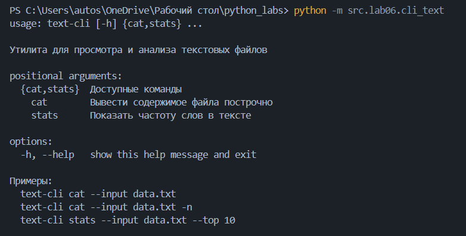
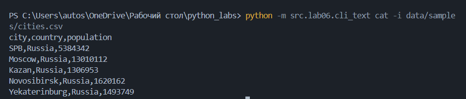
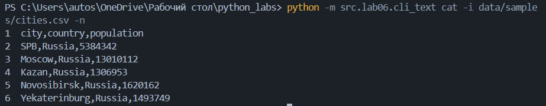

# ЛР6 — CLI‑утилиты с argparse (cat/grep‑lite + конвертеры): Техническое задание

> **Цель:** Научиться создавать консольные инструменты с аргументами командной строки, подкомандами и флагами.  
> **Связь:** продолжение ЛР5 (работа с JSON/CSV/XLSX) и подготовка к ЛР7 (тестирование).  
> Основная задача — обернуть существующие функции конвертации и анализа текста в CLI‑оболочки с помощью **argparse**.

---

## Структура
- Код:*[Задание 1](cli_text.py/)*
      *[Задание 2](cli_convert.py/)*
- Скриншоты: `images/lab06/`

---

## Задание 1 — модуль `src/lab06/cli_text.py`
**Файл:** `cli_text.py`  
### Код:
```
import argparse
import sys  
from pathlib import Path
from src.lab03.text import count_freq, top_n, tokenize


def main():
    parser = argparse.ArgumentParser(
        prog="text-cli",
        description="Утилита для просмотра и анализа текстовых файлов",
        epilog="""
Примеры:
  text-cli cat --input data.txt
  text-cli cat --input data.txt -n
  text-cli stats --input data.txt --top 10
        """,
        formatter_class=argparse.RawDescriptionHelpFormatter
    )

    subparsers = parser.add_subparsers(dest="command", help="Доступные команды")

    # Подкоманда: cat
    cat_parser = subparsers.add_parser("cat", help="Вывести содержимое файла построчно")
    cat_parser.add_argument("--input", "-i", type=Path, required=True, help="Путь к входному текстовому файлу")
    cat_parser.add_argument("-n", action="store_true", help="Добавить нумерацию строк")

    # Подкоманда: stats
    stats_parser = subparsers.add_parser("stats", help="Показать частоту слов в тексте")
    stats_parser.add_argument("--input", "-i", type=Path, required=True, help="Путь к файлу для анализа")
    stats_parser.add_argument("--top", "-t", type=int, default=5, help="Количество самых частотных слов (по умолчанию: 5)")

    args = parser.parse_args()

    # Проверка: команда обязательна
    if not args.command:
        parser.print_help()
        sys.exit(1)

    input_path = args.input

    try:
        if args.command == "cat":
            with input_path.open(mode='r', encoding='utf-8') as f:
                for line_num, line in enumerate(f, start=1):
                    line = line.rstrip('\n\r')
                    if args.n:
                        print(f"{line_num}  {line}")
                    else:
                        print(line)

        elif args.command == "stats":
            with input_path.open(mode='r', encoding='utf-8') as f:
                text = f.read()
                tokens = tokenize(text)
            freq = count_freq(tokens)
            top_words = top_n(freq, args.top)
            for word, count in top_words:
                print(f"{word}: {count}")

        else:
            parser.print_help()
            sys.exit(1)

    except FileNotFoundError:
        print(f"Ошибка: файл не найден — '{input_path}'", file=sys.stderr)
        sys.exit(1)

    except PermissionError:
        print(f"Ошибка: нет прав на чтение файла — '{input_path}'", file=sys.stderr)
        sys.exit(1)

    except IsADirectoryError:
        print(f"Ошибка: указан путь к папке, а не к файлу — '{input_path}'", file=sys.stderr)
        sys.exit(1)

    except UnicodeDecodeError:
        print(f"Ошибка: файл '{input_path}' не может быть прочитан как текст в кодировке UTF-8.", file=sys.stderr)
        sys.exit(1)

    except Exception as e:
        print(f"Неизвестная ошибка: {e}", file=sys.stderr)
        sys.exit(1)


if __name__ == "__main__":
    main()  
```

---

## Задание 2 — модуль `scr/lab06/cli_convert.py`
**Файл:** `cli_convert.py`  
### Код:
```
import argparse
import sys  
from pathlib import Path
from src.lab05.json_csv import json_to_csv, csv_to_json
from src.lab05.csv_xlsx import csv_to_xlsx


def main():
    parser = argparse.ArgumentParser(
        prog="data-converter",
        description="Утилита для конвертации данных между форматами: JSON, CSV, XLSX",
        epilog="""
Примеры:
  data-converter json2csv --in data.json --out data.csv
  data-converter csv2json --in data.csv --out data.json
  data-converter csv2xlsx --in data.csv --out data.xlsx
        """,
        formatter_class=argparse.RawDescriptionHelpFormatter
    )

    sub = parser.add_subparsers(dest="cmd", help="Доступные команды конвертации")

    # Команда: json2csv
    p1 = sub.add_parser("json2csv", help="Конвертировать JSON в CSV")
    p1.add_argument("--in", "-i", dest="input", type=Path, required=True, help="Входной JSON-файл")
    p1.add_argument("--out", "-o", dest="output", type=Path, required=True, help="Выходной CSV-файл")

    # Команда: csv2json
    p2 = sub.add_parser("csv2json", help="Конвертировать CSV в JSON")
    p2.add_argument("--in", "-i", dest="input", type=Path, required=True, help="Входной CSV-файл")
    p2.add_argument("--out", "-o", dest="output", type=Path, required=True, help="Выходной JSON-файл")

    # Команда: csv2xlsx
    p3 = sub.add_parser("csv2xlsx", help="Конвертировать CSV в XLSX")
    p3.add_argument("--in", "-i", dest="input", type=Path, required=True, help="Входной CSV-файл")
    p3.add_argument("--out", "-o", dest="output", type=Path, required=True, help="Выходной XLSX-файл")

    args = parser.parse_args()

    # Проверка: команда обязательна
    if not args.cmd:
        parser.print_help()
        sys.exit(1)

    # Конвертация
    try:
        input_file = args.input
        output_file = args.output

        if args.cmd == "json2csv":
            json_to_csv(input_file, output_file)
            print(f"Успешно сохранено: {output_file}")
        elif args.cmd == "csv2json":
            csv_to_json(input_file, output_file)
            print(f"Успешно сохранено: {output_file}")
        elif args.cmd == "csv2xlsx":
            csv_to_xlsx(input_file, output_file)
            print(f"Успешно сохранено: {output_file}")
        else:
            parser.print_help()
            sys.exit(1)

    except FileNotFoundError:
        print(f"Ошибка: входной файл не найден — '{input_file}'", file=sys.stderr)
        sys.exit(1)

    except IsADirectoryError:
        print(f"Ошибка: путь '{input_file}' — это папка, а не файл", file=sys.stderr)
        sys.exit(1)

    except PermissionError as e:
        print(f"Ошибка доступа: {e}", file=sys.stderr)
        sys.exit(1)

    except Exception as e:
        print(f"Ошибка при конвертации: {e}", file=sys.stderr)
        sys.exit(1)


if __name__ == "__main__":
    main()  
```

---

### Проверка:
### Задание 1.

**help**



**cat**



**cat -n**



**stats**


### Задание 2.

**help**


**json2csv**


**csv2json**


---
