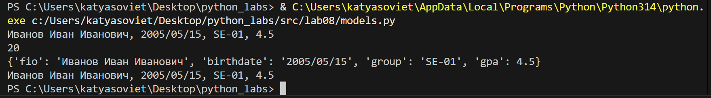
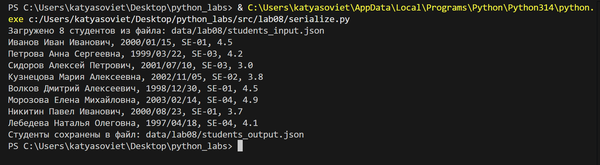

# ЛР8 – ООП в Python: @dataclass Student, методы и сериализация:

## Структура
- Код:*[Задание А](models.py/)*
      *[Задание В](serialize.py/)*
- Скриншоты: `images/lab08/`

---

## Задание A — модуль `scr/lab08/models.py`
**Файл:** `models.py`  

### Код:
```
from dataclasses import dataclass
from datetime import datetime, date


@dataclass
class Student:
    fio: str
    birthdate: str
    group: str
    gpa: float

    def __post_init__(self):
        try:
            datetime.strptime(self.birthdate, "%Y/%m/%d")
        except ValueError:
            raise ValueError(f"Неверный формат даты: '{self.birthdate}'. Ожидается ГГГГ/ММ/ДД")

        if not (0 <= self.gpa <= 5):
            raise ValueError("gpa должен быть от 0 до 5 включительно")

    def age(self) -> int:
        birth = datetime.strptime(self.birthdate, "%Y/%m/%d").date()
        today = date.today()

        age = today.year - birth.year 
        if (today.month, today.day) < (birth.month, birth.day):
            age -= 1  

        return age  

    def to_dict(self) -> dict:
        return {
            "fio": self.fio,      
            "birthdate": self.birthdate, 
            "group": self.group,    
            "gpa": self.gpa         
        }

    @classmethod
    def from_dict(cls, d: dict):
        return cls(
            fio=d["fio"],     
            birthdate=d["birthdate"],
            group=d["group"],
            gpa=d["gpa"]
        )

    def __str__(self):
        return f"{self.fio}, {self.birthdate}, {self.group}, {self.gpa}"
        
# Пример

s = Student("Иванов Иван Иванович", "2005/05/15", "SE-01", 4.5)
print(s)                   
print(s.age())              
data = s.to_dict()
print(data)          
s2 = Student.from_dict(data) 
print(s2)
```

---

## Задание B — модуль `scr/lab08/serialize.py`
**Файл:** `serialize.py`  

### Код:
```
import json
from typing import List
from models import Student


def students_to_json(students: List[Student], path: str) -> None:
    data = [s.to_dict() for s in students]
    with open(path, 'w', encoding='utf-8') as file:
        json.dump(data, file, ensure_ascii=False, indent=2)
    print(f"Студенты сохранены в файл: {path}")


def students_from_json(path: str) -> List[Student]:
    try:
        with open(path, 'r', encoding='utf-8') as file:
            data = json.load(file)

        if not isinstance(data, list):
            print(f"Ошибка: ожидается список")
            return []

        students = []
        for item in data:
            if not isinstance(item, dict):
                print(f"Пропущен элемент: не является словарём — {item}")
                continue
            try:
                student = Student.from_dict(item)
                students.append(student)
            except ValueError as e:
                print(f"Не удалось создать студента из данных {item}: {e}")

        print(f"Загружено {len(students)} студентов из файла: {path}")
        return students

    except FileNotFoundError:
        print(f"Файл не найден: {path}")
        return []

    except json.JSONDecodeError as e:
        print(f"Ошибка чтения JSON: {e}")
        return []

    except Exception as e:
        print(f"Непредвиденная ошибка при чтении файла: {e}")
        return []

#Пример 
loaded_students = students_from_json("data/lab08/students_input.json")
for s in loaded_students:
    print (s)
students_to_json(loaded_students, "data/lab08/students_output.json")
```

---

### Проверка:
### Задание A.
**people.csv**




### Задание B.
**serialize**



---
