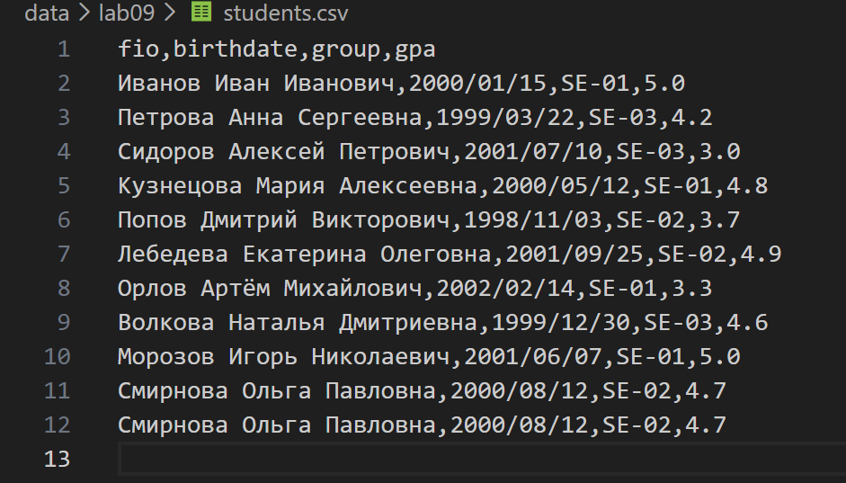
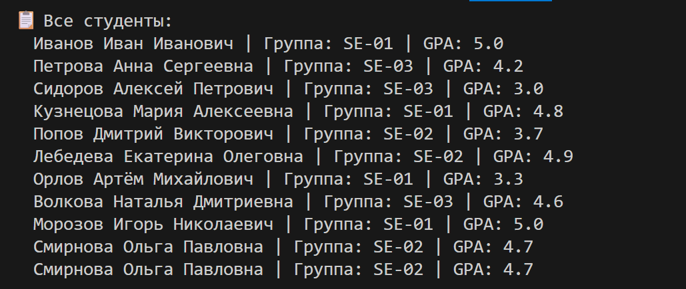
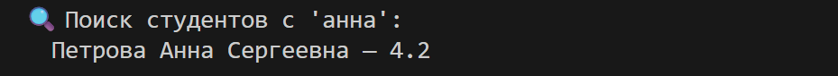
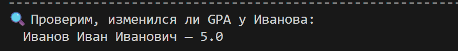
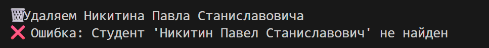
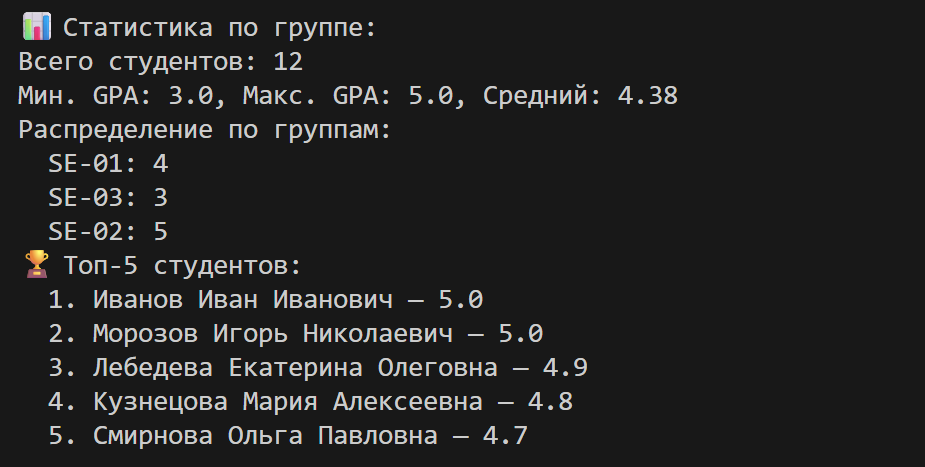
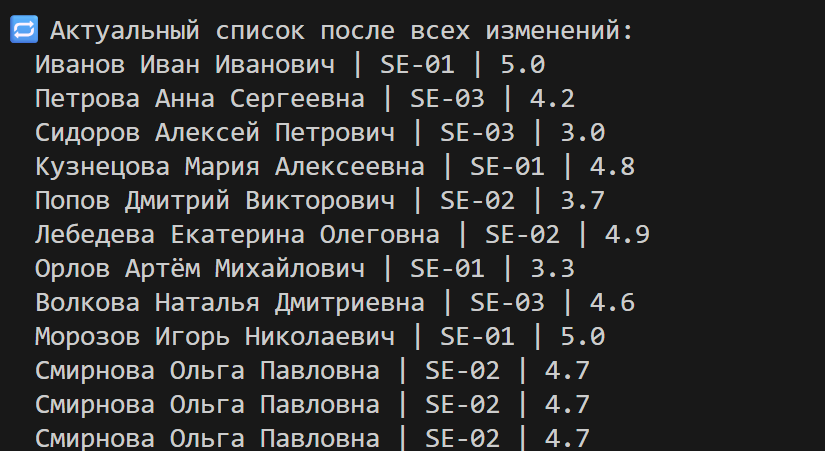

# ЛР9 — «База данных» на CSV: класс `Group`, CRUD-операции
## Структура
- Код:*[Задание А](group.py/)*
- Скриншоты: `images/lab09/`

---

## Задание A — модуль `scr/lab09/group.py`
**Файл:** `group.py`  

### Код:
```
import csv
from pathlib import Path
from src.lab08.models import Student


class Group:
    def __init__(self, storage_path: str):
        self.path = Path(storage_path)
        if not self.path.exists():
            self.path.write_text("", encoding="utf-8")

    def _read_all(self):
        if not self.path.exists() or self.path.stat().st_size == 0:
            return
        with self.path.open(encoding="utf-8") as f:
            reader = csv.DictReader(f)
            for row in reader:
                yield Student(
                    fio=row["fio"],
                    birthdate=row["birthdate"],
                    group=row["group"],
                    gpa=float(row["gpa"]),
                )

    def _rewrite(self, students):
        with self.path.open("w", encoding="utf-8", newline="") as f:
            writer = csv.writer(f)
            writer.writerow(["fio", "birthdate", "group", "gpa"])
            for student in students:
                writer.writerow([student.fio, student.birthdate, student.group, student.gpa])

    def list(self):
        return list(self._read_all())

    def add(self, student: Student):
        file_empty = not self.path.exists() or self.path.stat().st_size == 0
        with self.path.open("a", encoding="utf-8", newline="") as f:
            writer = csv.writer(f)
            if file_empty:
                writer.writerow(["fio", "birthdate", "group", "gpa"])
            writer.writerow([student.fio, student.birthdate, student.group, student.gpa])

    def find(self, substr: str):
        return [
            student for student in self.list() if substr.lower() in student.fio.lower()
        ]

    def remove(self, fio: str):
        students = self.list()
        for i, student in enumerate(students):
            if student.fio == fio:
                students.pop(i)  # удаляет и запоминает
                self._rewrite(students)
                return
        raise ValueError(f"Студент '{fio}' не найден")

    def update(self, fio: str, **fields):
        students = self.list()
        for student in students:
            if student.fio == fio:
                if "fio" in fields:
                    student.fio = fields["fio"]
                if "birthdate" in fields:
                    student.birthdate = fields["birthdate"]
                if "group" in fields:
                    student.group = fields["group"]
                if "gpa" in fields:
                    student.gpa = float(fields["gpa"])
                self._rewrite(students)
                return
        raise ValueError(f"Студент с ФИО '{fio}' не найден")

    def stats(self) -> dict:
        students = self.list()
        if not students:
            return {
                "count": 0,
                "min_gpa": None,
                "max_gpa": None,
                "avg_gpa": None,
                "groups": {},
                "top_5_students": [],
            }

        count = len(students)
        gpas = [student.gpa for student in students]
        min_gpa = min(gpas)
        max_gpa = max(gpas)
        avg_gpa = round(sum(gpas) / len(gpas), 2) #округление до второго знака после запятой

        groups = {}
        for student in students:
            groups[student.group] = groups.get(student.group, 0) + 1

        top_5_students = [
            {"fio": student.fio, "gpa": student.gpa}
            for student in sorted(students, key=lambda student: student.gpa, reverse=True)[:5]
        ]

        return {
            "count": count,
            "min_gpa": min_gpa,
            "max_gpa": max_gpa,
            "avg_gpa": avg_gpa,
            "groups": groups,
            "top_5_students": top_5_students,
        }
```

---

### Проверка:

### Задание A.
**groups**

### Через код **examples.py**

```
from src.lab09.group import Group
from src.lab08.models import Student


# Создаём экземпляр группы
group = Group("data/lab09/students.csv")
```


```
# ===================================================================
# 1. list() — получить всех студентов
# ===================================================================
print("📋 Все студенты:")
students = group.list()
for s in students:
    print(f"  {s.fio} | Группа: {s.group} | GPA: {s.gpa}")
print("-" * 60)
```


```
# ===================================================================
# 2. find(substr) — поиск по ФИО
# ===================================================================
print("🔍 Поиск студентов с 'анна':")
found = group.find("анна")
for s in found:
    print(f"  {s.fio} — {s.gpa}")
print("-" * 60)
```


```
# ===================================================================
# 3. add(student) — добавить нового студента
# ===================================================================
new_student = Student(
    fio="Смирнова Ольга Павловна",
    birthdate="2000/08/12",
    group="SE-02",
    gpa=4.7
)
group.add(new_student)
print(f"✅ Добавлен: {new_student.fio}")
print("-" * 60)
```


```
# ===================================================================
# 4. update(fio, **fields) — обновить данные
# ===================================================================
print("🔄 Обновляем GPA Иванова Ивана Ивановича до 5.0")
group.update("Иванов Иван Иванович", gpa=5.0)
print("-" * 60)
```




```
# ===================================================================
# 5. find() после обновления
# ===================================================================
print("🔍 Проверим, изменился ли GPA у Иванова:")
ivanov = group.find("Иванов")[0]
print(f"  {ivanov.fio} — {ivanov.gpa}")
print("-" * 60)
```


```
# ===================================================================
# 6. remove(fio) — удалить студента
# ===================================================================
print("🗑️ Удаляем Никитина Павла Станиславовича")
try:
    group.remove("Никитин Павел Станиславович")
    print("✅ Удалён")
except ValueError as e:
    print(f"❌ Ошибка: {e}")
print("-" * 60)
```


```
# ===================================================================
# 7. stats() — аналитика
# ===================================================================
print("📊 Статистика по группе:")
stats = group.stats()

print(f"Всего студентов: {stats['count']}")
print(f"Мин. GPA: {stats['min_gpa']}, Макс. GPA: {stats['max_gpa']}, Средний: {stats['avg_gpa']}")
print("Распределение по группам:")
for gr, count in stats['groups'].items():
    print(f"  {gr}: {count}")

print("🏆 Топ-5 студентов:")
for i, s in enumerate(stats['top_5_students'], 1):
    print(f"  {i}. {s['fio']} — {s['gpa']}")
print("-" * 60)
```


```
# ===================================================================
# 8. Повторный list() — проверка изменений
# ===================================================================
print("🔁 Актуальный список после всех изменений:")
for s in group.list():
    print(f"  {s.fio} | {s.group} | {s.gpa}")
```


---
