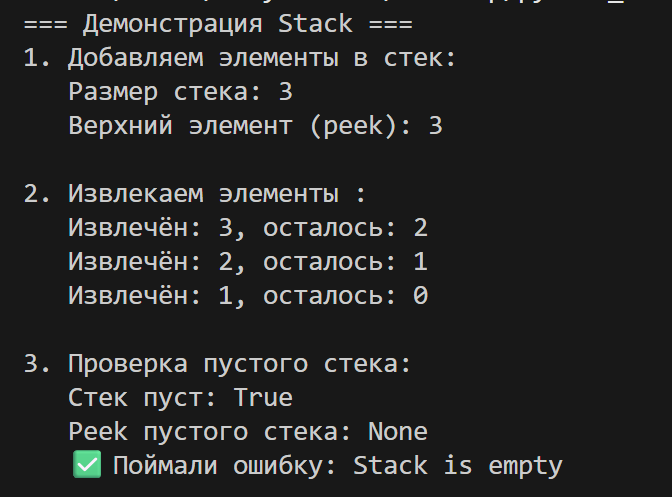
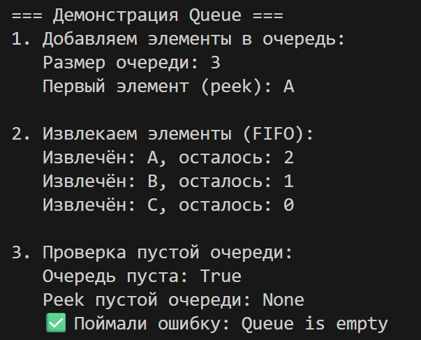
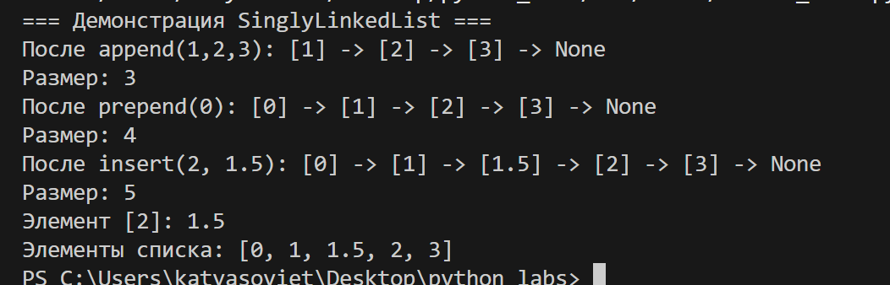

# ЛР10 — Структуры данных: Stack, Queue, Linked List и бенчмарки
## Структура
- Код:*[Задание А](structures.py/)*
- Скриншоты: `images/lab10/`

---

## Задание A — модуль `scr/lab10/strustures.py`
**Файл:** `structures.py`  

### Код:
```
from collections import deque
from typing import Any, Optional


class Stack:
    def __init__(self):
        self._data: list[Any] = []

    def push(self, item: Any) -> None:
        self._data.append(item)

    def pop(self) -> Any:
        if self.is_empty():
            raise IndexError("Stack is empty")
        return self._data.pop()

    def peek(self) -> Optional[Any]:
        if self.is_empty():
            return None
        return self._data[-1]

    def is_empty(self) -> bool:
        return len(self._data) == 0

    def __len__(self) -> int:
        return len(self._data)


class Queue:
    def __init__(self):
        self._data: deque[Any] = deque()  

    def enqueue(self, item: Any) -> None:
        self._data.append(item) 

    def dequeue(self) -> Any:
        if self.is_empty():
            raise IndexError("Queue is empty")
        return self._data.popleft()

    def peek(self) -> Optional[Any]:
        if self.is_empty():
            return None
        return self._data[0]

    def is_empty(self) -> bool:
        return len(self._data) == 0

    def __len__(self) -> int:
        return len(self._data)  


if __name__ == "__main__":
    print("=== Демонстрация Stack ===")
    
    # Пример использования Stack
    stack = Stack()
    
    print("1. Добавляем элементы в стек:")
    stack.push(1)
    stack.push(2)
    stack.push(3)
    print(f"   Размер стека: {len(stack)}")
    print(f"   Верхний элемент (peek): {stack.peek()}")
    
    print("\n2. Извлекаем элементы :")
    while not stack.is_empty():
        item = stack.pop()
        print(f"   Извлечён: {item}, осталось: {len(stack)}")
    
    print("\n3. Проверка пустого стека:")
    print(f"   Стек пуст: {stack.is_empty()}")
    print(f"   Peek пустого стека: {stack.peek()}")
    
    try:
        stack.pop()
    except IndexError as e:
        print(f"   ✅ Поймали ошибку: {e}")
    
    print("\n" + "="*50)
    print("=== Демонстрация Queue ===")
    
    # Пример использования Queue
    queue = Queue()
    
    print("1. Добавляем элементы в очередь:")
    queue.enqueue("A")
    queue.enqueue("B")
    queue.enqueue("C")
    print(f"   Размер очереди: {len(queue)}")
    print(f"   Первый элемент (peek): {queue.peek()}")
    
    print("\n2. Извлекаем элементы (FIFO):")
    while not queue.is_empty():
        item = queue.dequeue()
        print(f"   Извлечён: {item}, осталось: {len(queue)}")
    
    print("\n3. Проверка пустой очереди:")
    print(f"   Очередь пуста: {queue.is_empty()}")
    print(f"   Peek пустой очереди: {queue.peek()}")
    
    try:
        queue.dequeue()
    except IndexError as e:
        print(f"   ✅ Поймали ошибку: {e}")
    
    print("\n" + "="*50)
```

---

## Задание B — модуль `scr/lab10/linked_list.py`
**Файл:** `linked_list.py`  

### Код:
```
from typing import Any, Optional, Iterator


class Node:
    def __init__(self, value: Any, next: Optional['Node'] = None):
        self.value = value
        self.next = next


class SinglyLinkedList:
    def __init__(self):
        self._head: Optional[Node] = None
        self._tail: Optional[Node] = None
        self._size: int = 0

    def append(self, value: Any) -> None:
        new_node = Node(value)
        if self._head is None:
            self._head = new_node
            self._tail = new_node
            self._size += 1
        else:
            self._tail.next = new_node
            self._tail = new_node
            self._size += 1

    def prepend(self, value: Any) -> None:
        new_node = Node(value, next=self._head)
        self._head = new_node
        self._size += 1  

        if self._size == 1:
            self._tail = new_node

    def insert(self, idx: int, value: Any) -> None:
        if idx < 0 or idx > self._size:
            raise IndexError(f"Index {idx} out of range")

        if idx == 0:
            self.prepend(value)
            return

        if idx == self._size:
            self.append(value)
            return

        new_node = Node(value)
        current = self._head

        for _ in range(idx - 1):
            if current is None:
                raise IndexError(f"Index {idx} out of range")
            current = current.next

        new_node.next = current.next
        current.next = new_node
        self._size += 1  

    def __iter__(self) -> Iterator[Any]:
        current = self._head
        while current is not None:
            yield current.value
            current = current.next
        
    def __len__(self) -> int:
        return self._size  

    def __repr__(self) -> str:
        values = list(self)
        return f"SinglyLinkedList({values})"
    
    def is_empty(self) -> bool:
        return self._size == 0
    
    def get(self, idx: int) -> Any:
        if idx < 0 or idx >= self._size:
            raise IndexError(f"Index {idx} out of range")
        
        current = self._head
        for _ in range(idx):
            current = current.next
        return current.value

    def visualize(self) -> str:
        if self._head is None:
            return "None"
        
        parts = []
        current = self._head

        while current is not None:
            if current.value is None:
                formatted_value = "None"
            elif isinstance(current.value, str):
                formatted_value = f"'{current.value}'"
            else:
                formatted_value = str(current.value)
            
            parts.append(f"[{formatted_value}]")
            current = current.next
        
        parts.append("None")
        return " -> ".join(parts)


if __name__ == "__main__":
    lst = SinglyLinkedList()
    
    print("=== Демонстрация SinglyLinkedList ===")

    lst.append(1)
    lst.append(2)
    lst.append(3)
    print(f"После append(1,2,3): {lst.visualize()}")
    print(f"Размер: {len(lst)}")

    lst.prepend(0)
    print(f"После prepend(0): {lst.visualize()}")
    print(f"Размер: {len(lst)}")

    lst.insert(2, 1.5)
    print(f"После insert(2, 1.5): {lst.visualize()}")
    print(f"Размер: {len(lst)}")

    print(f"Элемент [2]: {lst.get(2)}")
    print("Элементы списка:", list(lst))
```

---

### Проверка:

### Задание A.
**Stack**

### Через код проверки из **structures.py**




**Queue**

### Через код проверки из **structures.py**




### Задание B.
**SinglyLinkedList**

### Через код проверки из **linked_list.py**




---
