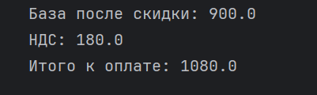
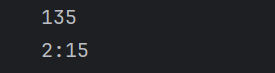

# ЛР1 — Ввод/вывод и форматирование

## Структура
- Код: `src/lab_01/`
- Скриншоты: `images/lab01/`

---

## Задание 1 — Привет и возраст
**Файл:** `01_name_age.py`  
**Задача:** спросить имя и возраст, вывести приветствие и возраст через год.  

**Пример:**
```
Имя: Катя
Возраст: 17
Привет, Катя! Через год тебе будет 18.
```

**Скриншот:**  


---

## Задание 2 — Сумма и среднее
**Файл:** `02_sum_avg.py`  
**Задача:** ввести два вещественных числа (с точкой или запятой), вывести сумму и среднее с двумя знаками после запятой.  

**Пример:**
```
a: 3,5
b: 4.25
sum=7.75; avg=3.88
```

**Скриншот:**  


---

## Задание 3 — Чек: скидка и НДС
**Файл:** `03_discount.py`  
**Задача:** посчитать цену после скидки, НДС и итоговую сумму.  

**Пример (price=1000, discount=10, vat=20):**
```
База после скидки: 900.00 ₽
НДС:               180.00 ₽
Итого к оплате:    1080.00 ₽
```

**Скриншот:**  


---

## Задание 4 — Минуты → ЧЧ:ММ
**Файл:** `04_minutes.py`  
**Задача:** перевести целые минуты в формат `ЧЧ:ММ`.  

**Пример:**
```
Минуты: 135
2:15
```

**Скриншот:**  


---

## Задание 5 — Инициалы и длина строки
**Файл:** `05_initials_len.py`  
**Задача:** ввести ФИО (с возможными лишними пробелами), вывести инициалы и длину строки без крайних пробелов.  

**Пример:**
```
ФИО:   Иванов   Иван   Иванович  
Инициалы: ИИИ.
Длина (символов): 20
```

**Скриншот:**  


---
